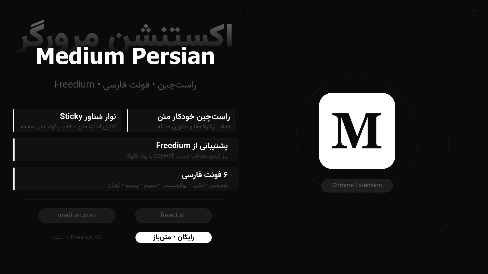

<div dir="rtl">
<div align="center">

</div>
<div align="center">

# 📖 Medium فارسی

**اکستنشن کروم برای مطالعه راحت‌تر مقالات Medium به فارسی**

راست‌چین خودکار • ۶ فونت فارسی • نوار کنترل شناور • پشتیبانی از Freedium

[](https://github.com/YOUR_USERNAME/medium-farsi-extension)
[](#)
[](#)
[](#)

</div>

---

## ✨ قابلیت‌ها

| قابلیت                      | جزئیات                                                       |
| --------------------------- | ------------------------------------------------------------ |
| ↔ **راست‌چین هوشمند**       | متن، عناوین، لیست‌ها و blockquote — کدها دست‌نخورده می‌مانند |
| 🔤 **۶ فونت فارسی**         | وزیرمتن، یکان، ایران‌سنس، شبنم، پرستو، تهران                 |
| 📏 **کنترل اندازه متن**     | ۴ سایز با دکمه‌های A- / A+                                   |
| 📌 **نوار شناور Sticky**    | همیشه در دسترس، هنگام اسکرول محو می‌شود                      |
| 🔓 **پشتیبانی از Freedium** | باز کردن مقالات پشت paywall با یک کلیک                       |
| 💾 **ذخیره تنظیمات**        | فونت و اندازه انتخابی برای دفعات بعد حفظ می‌شود              |
| 🖱️ **منوی راست‌کلیک**       | دسترسی سریع بدون باز کردن popup                              |

---

## 📥 نصب

### روش ۱ — دانلود مستقیم (توصیه‌شده)

```
۱. آخرین نسخه ZIP را از صفحه Releases دانلود کنید
۲. فایل را extract کنید
۳. در کروم: chrome://extensions را باز کنید
۴. Developer mode را از گوشه بالا راست روشن کنید
۵. Load unpacked را بزنید و پوشه medium-rtl-extension را انتخاب کنید
```

<a href="https://github.com/Amirrezaheydari81/Medium-Persian/releases/download/v2/medium-rtl-extension.zip"> 🔗 دانلود نسخه 2 (zip)
</a>

### روش ۲ — کلون از گیت‌هاب

```bash
git clone https://github.com/YOUR_USERNAME/medium-farsi-extension.git
```

سپس مراحل ۳ تا ۵ بالا را دنبال کنید.

### مرورگرهای پشتیبانی‌شده

| مرورگر         | وضعیت                   |
| -------------- | ----------------------- |
| Google Chrome  | ✅ کامل                 |
| Microsoft Edge | ✅ کامل                 |
| Brave          | ✅ کامل                 |
| Firefox        | ❌ نیاز به پورت جداگانه |

---

## 🚀 نحوه استفاده

### نوار شناور (روش اصلی)

هنگام بازدید از Medium یا Freedium، یک نوار کوچک در پایین صفحه ظاهر می‌شود:

```
[ M ]  [ وزیرمتن ▾ ]  [ A- ]  [ A+ ]  [ ↗ ]
  ↑         ↑            ↑       ↑       ↑
toggle   انتخاب       کوچک‌تر  بزرگ‌تر  باز در
روشن/    فونت                          Freedium
خاموش
```

### Popup اکستنشن

روی آیکون **M** در نوار ابزار کلیک کنید:

- **Toggle** راست‌چین را روشن/خاموش کنید
- وضعیت سایت فعلی (Medium یا Freedium) نمایش داده می‌شود
- دکمه **باز در Freedium** برای مقالات Medium

### منوی راست‌کلیک

روی هر صفحه‌ای از Medium یا Freedium راست‌کلیک کنید:

- `↔ راست‌چین فارسی` — فعال/غیرفعال کردن
- `🔓 باز در Freedium` — فقط روی medium.com

---

## 🗂️ ساختار پروژه

```
medium-rtl-extension/
├── manifest.json       # تنظیمات اکستنشن (Manifest V3)
├── background.js       # Service worker — منوی راست‌کلیک
├── content.js          # اسکریپت اصلی — RTL، فونت، نوار شناور
├── popup.html          # رابط کاربری popup (فونت embed‌شده)
├── popup.js            # منطق popup
├── icon16.png
├── icon48.png
└── icon128.png
```

---

## 🔐 دسترسی‌های مورد نیاز

| دسترسی                      | دلیل                               |
| --------------------------- | ---------------------------------- |
| `activeTab`                 | خواندن آدرس تب فعال                |
| `contextMenus`              | اضافه کردن گزینه به منوی راست‌کلیک |
| `storage`                   | ذخیره فونت و اندازه انتخابی        |
| `scripting`                 | اجرای کد RTL در صفحه               |
| `host: medium.com`          | محدود به سایت Medium               |
| `host: freedium-mirror.cfd` | محدود به سایت Freedium             |

> اکستنشن **هیچ داده‌ای را به سرور ارسال نمی‌کند**. همه عملیات محلی است.

---

## 🛠️ توسعه

### پیش‌نیازها

- Google Chrome نسخه ۸۸ یا بالاتر (Manifest V3)
- هیچ dependency خارجی لازم نیست

### تست محلی

```bash
git clone https://github.com/YOUR_USERNAME/medium-farsi-extension.git
cd medium-farsi-extension
```

پس از هر تغییر در کد، در صفحه `chrome://extensions` روی آیکون 🔄 کلیک کنید.

### اضافه کردن فونت جدید

در `content.js` آرایه `FONTS` را پیدا کنید:

```javascript
const FONTS = [
  { label: "وزیرمتن", value: "Vazirmatn" },
  { label: "یکان", value: "Yekan Bakh" },
  // فونت جدید را اینجا اضافه کنید:
  { label: "نام نمایشی", value: "Font Family Name" },
];
```

سپس `@font-face` آن را به بخش `RTL_CSS` اضافه کنید.

### اضافه کردن سایت جدید

**۱. در `manifest.json`:**

```json
"host_permissions": [
  "https://medium.com/*",
  "https://*.medium.com/*",
  "https://freedium-mirror.cfd/*",
  "https://NEW-SITE.com/*"
],
"content_scripts": [{
  "matches": [
    "https://medium.com/*",
    "https://*.medium.com/*",
    "https://freedium-mirror.cfd/*",
    "https://NEW-SITE.com/*"
  ]
}]
```

**۲. در `popup.js`:**

```javascript
function isTarget(url) {
  const h = new URL(url).hostname;
  return (
    h === "medium.com" ||
    h.endsWith(".medium.com") ||
    h === "freedium-mirror.cfd" ||
    h === "new-site.com"
  ); // اضافه کنید
}
```

**۳. در `background.js`** — `documentUrlPatterns` را آپدیت کنید.

### بهبود CSS انتخابگرها

در `content.js` تابع `buildCSS` — انتخابگرهای مناسب سایت هدف را اضافه کنید:

```javascript
article,
[data-testid="post-content"],
.your-new-site-content-class, /* اضافه کنید */
h1, h2, h3, p, li {
  direction: rtl !important;
  ...
}
```

---

## 🗺️ نقشه راه توسعه

- [ ] پشتیبانی از سایت‌های بیشتر (Substack، Hashnode، Dev.to)
- [ ] تنظیم line-height از نوار شناور
- [ ] حالت شب اختصاصی
- [ ] انتشار در Chrome Web Store
- [ ] پورت برای Firefox

---

## 🤝 مشارکت

Pull request خوشامد است! لطفاً برای تغییرات بزرگ ابتدا یک Issue باز کنید.

---

## 📄 لایسنس

MIT License — استفاده، تغییر و توزیع آزاد است.

</div>
